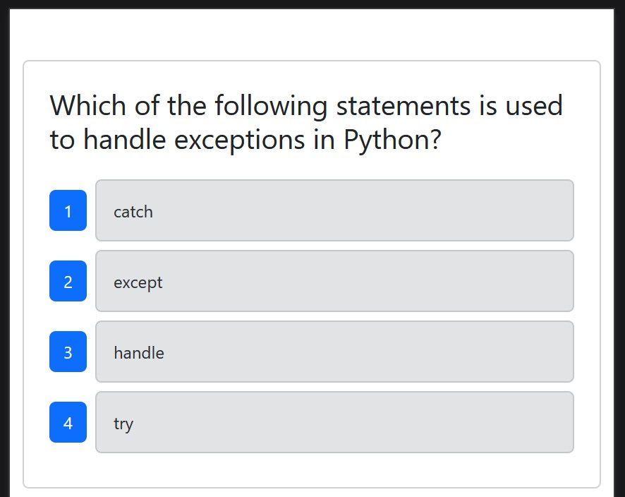
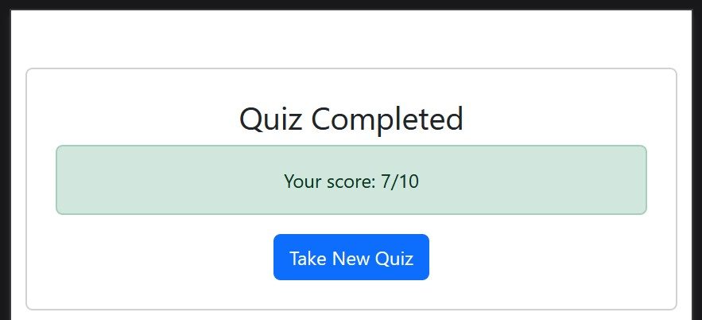

# Test Center

## Description
An application designed to test GitHub Actions including the triggering of Cypress testing when a PR is submitted to the develop branch and the automatic deployment of the main branch to Render. This project utilized EdX starter code.

## Table of Contents
- [Installation](#installation)
- [Usage](#usage)
- [License](#license)
- [Contributing](#contributing)
- [Tests](#tests)
- [Questions](#questions)

## Installation
Visit the URL:
[Deployed on Render](https://test-center-afwv.onrender.com/)

## Usage
Visit the deployment URL (above) and participate in the quiz provided, following the on-screen prompts.

Ten questions will be given, for which a score will be tallied at the end:

## License
This project is licensed under the MIT license. For more details, see the license link: (https://opensource.org/licenses/MIT)

## Contributing
As this is a project strictly for educational purposes, no contributions will be accepted.

## Tests
This project uses Cypress to automatically run tests when PRs to the develop branch are opened.

## Questions
##### For any questions regarding this project, contact the project owner via: 
GitHub: [apoborka](https://github.com/apoborka)\
Email: alex.poborka@gmail.com

## Acknowledgments
This project utilized GitHub Copilot and EdX starter code.